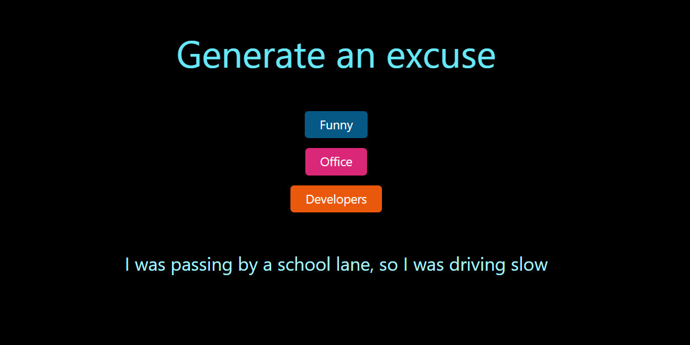

# Excuser App
## Technologies used
- HTML
- Tailwind CSS
- JavaScript
- ReactJS



```jsx
   <div className="bg-black w-full min-h-screen text-white pt-24 flex flex-col justify-start items-center gap-4 text-5xl">
    <h1 className="text-6xl text-cyan-300 pb-12">Generate an excuse</h1>
    <button onClick={() => {fetchData("funny")}}className="text-xl bg-sky-800 px-6 py-2 rounded-md">Funny</button>
    <button onClick={() => {fetchData("office")}}className="text-xl bg-pink-600 px-6 py-2 rounded-md">Office</button>
    <button onClick={() => {fetchData("developers")}} className="text-xl bg-orange-600 px-6 py-2 rounded-md ">Developers</button>
    <h1 className="py-12 text-3xl text-cyan-200">{excuse}</h1>
    </div>

```

hey