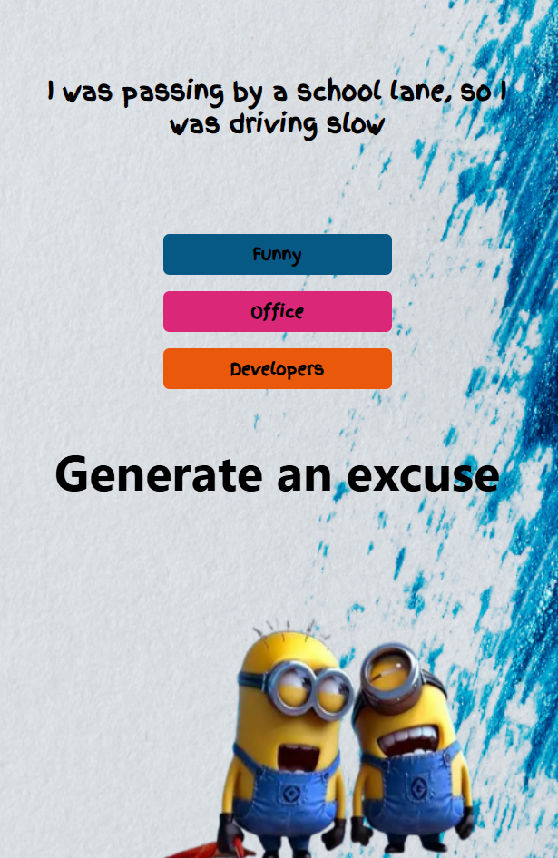
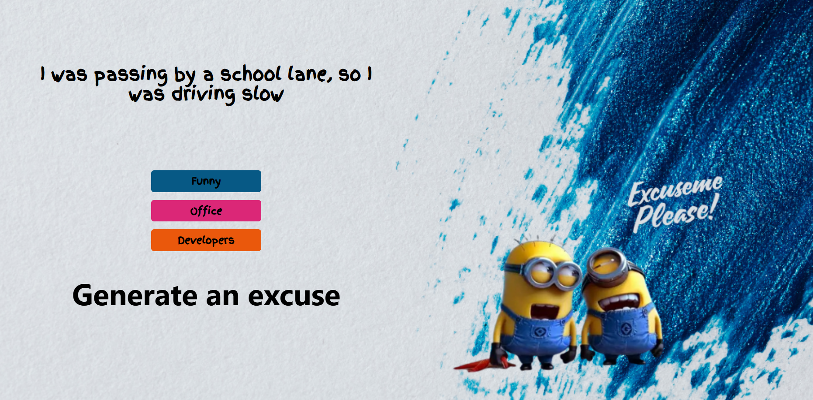

Here’s a **clean, professional `README.md`** for your React project. You can directly copy-paste this into your repository.

---

# 🎭 Excuse Generator App

A fun and responsive **React application** that generates random excuses using an external API. Users can generate excuses based on different categories such as **Funny**, **Office**, and **Developers** with a single click.

---

## 🚀 Features

* 🎲 Generates random excuses instantly
* 📱 Fully responsive (Mobile & Desktop layouts)
* ⚡ Fast API calls using **Axios**
* 🎨 Clean UI with background images
* 🧠 Uses React Hooks (`useState`)

---
### Preview

### mobile screen


### large screen


## 🛠️ Tech Stack

* **React**
* **Axios**
* **Tailwind CSS**
* **Excuser API**

---

## 🌐 API Used

**Excuser API**

```
https://excuser-three.vercel.app/v1/excuse/{category}/
```

Available categories:

* `funny`
* `office`
* `developers`

---

## 📂 Project Structure

```
src/
├── img/
│   ├── large.png
│   └── mobile.png
├── App.js
├── index.js
└── index.css
```

---

## ⚙️ Installation & Setup

1️⃣ Clone the repository

```bash
git clone https://github.com/your-username/excuse-generator.git
```

2️⃣ Navigate to project folder

```bash
cd excuse-generator
```

3️⃣ Install dependencies

```bash
npm install
```

4️⃣ Start the development server

```bash
npm start
```

The app will run on:

```
http://localhost:3000
```

---

## 🧩 How It Works

* The app uses **React state** to store the current excuse.
* On button click, Axios fetches a new excuse from the API.
* The UI updates dynamically without page reload.
* Background image changes based on screen size.

---

## 🖼️ Responsive Design

* 📱 **Mobile** → Displays `mobile.png`
* 💻 **Desktop** → Displays `large.png`

Handled using Tailwind utility classes:

```css
md:hidden
hidden md:flex
```

---

## 📌 Sample Code Snippet

```js
const fetchData = async (excuse) => {
  const { data } = await axios.get(
    `https://excuser-three.vercel.app/v1/excuse/${excuse}/`
  );
  setExcuse(data[0].excuse);
};
```

---

## 🌟 Future Enhancements

* 🔄 Loading spinner
* 🎨 Theme toggle
* 📋 Copy excuse to clipboard
* 🗂 More excuse categories

---


## 🙌 Acknowledgements

* Excuser API
* React Community
* Tailwind CSS

---


